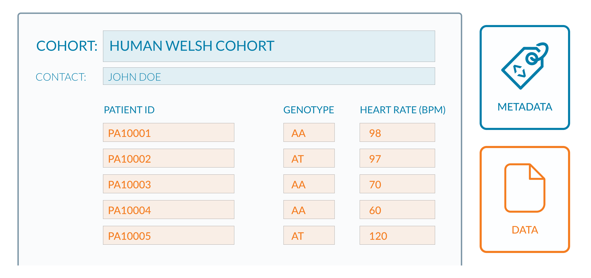

The FAIR Principles were created to help researchers share, reuse, and manage their data. These Principles will be discussed and contextualised later, but for now FAIR data can be understood defined as any dataset that can be discovered and downloaded by others; and interpreted correctly through the provision of detailed descriptions about the data.

Data descriptions are called termed **metadata**, and their  relationship between metadata and tothe data they describe is shown in the diagram below.  Here a PI called John Doe wishes to share data about the genotypes and heart rates for a number of patients in a study.  The data are shown in orange and takes the form of a spreadsheet.  It is obvious from this example that the data alone are meaningless without the companion metadata in blue which describe the column headings and data units (BPM), as well as metadata relating to the entire dataset where a contact and cohort name are given.  Without metadata, data cannot be reused correctly because it cannot be interpreted correctly.

{alt='alt text'}

:::::::::::::::::::::: challenge
Look at the metadata in blue above.  What could be done better?

::::::: solution
In terms of the column headings, these look pretty complete although patients will have many genotypes, so describing the genotype using its unique ID would be advised **(e.g. rs1333049)**.  Additionally, spaces in column names could be replaced with underscores to aid scripting using the data.  FOr example, **“PATIENT ID” → “PATIENT_ID”**

Additional metadata can be added for provenance and general descriptions. For example, more information about the cohort name is required because **“Human Welsh Cohort”** does tell us much in the context of other existing Welsh cohorts. Here we would look to include a unique ID or unique working title for the cohort, or a project URL describing its origin and makeup.  

There are many John Does in the World. Typically now, people will use ORCID IDs to uniquely identify themselves because this is a permanent ID and does not change when the details of an investigator changes, for example, when they change institution or email address.
::::::::::::
::::::::::::::::::::::::::

**As a side note, know that FAIR is not limited to the Life Sciences and spans across all research disciplines. The FAIR principles are also not limited to data and can be applied to the sharing and reuse of software, training and data workflow.**

::::::::::: challenge
What examples can you think of where software is shared in a way that is FAIR?

::::: solution
Software shared openly on github is FAIR: it can be discovered, downloaded and annotated in a way where it can be used successfully.  It is also assigned to the original author for provenance.
:::::::::::
:::::::::::::::::::

**The history of FAIR and its use today**

A report from the European Commission Expert Group on FAIR data describes the origins of FAIR and its first mention in 2014-2015 by a FORCE11 Working Group who define the FAIR Principles.  

FAIR is an acronym relating to a “thing” that is made Findable, Accessible, Interoperable and Reusable.   For FAIR data, the **thing** we refer to is the the data.  For a script or analysis workflow, the thing is “software”.

FAIR itself was then formalised and published in 2016 in FAIR Guiding Principles for scientific data management and stewardship.

::::::::::::::::::::::::::::::::::::: challenge
Read page 11 of the European Commission report.  What benefit did the FORCE11 Working Group see to coining the word FAIR? 

::::::::: solution
The report states: “a FORCE11 Working Group coined the FAIR data definition, latching onto an arresting and rhetorically useful acronym. The word play with fairness, in the sense of equity and justice, has also been eloquent in communicating the idea that FAIR data serves the best interests of the research community and the advancement of science as a public enterprise that benefits society. ”
:::::::::::::::::
:::::::::::::::::::::::::::::::::::::::::::

:::::::::::::::::::::::: challenge 
**FAIR isn’t limited to data. From the same report, what other examples of “objects” can be made FAIR?**(https://zenodo.org/record/1285272#.Yuk8O_HMIqt)

::::::: solution
On page 15, the report states: “FAIR should be applied broadly to all objects (including metadata, identifiers, software and
DMPs) that are essential to the practice of research, and should inform metrics relating directly to these objects.”  Noting that DMPs are “data management plans”.
::::::::::::::::
:::::::::::::::::::::::::::::::::

FAIR is now everywhere and used commonly in the arena of funded research.  To illustrate its importance, funders often require an applicant to justify why new data are being generated for a proposal, ( and why publically available data cannot be used instead at no cost).

::: callout
## Further reading demonstrating the benefits of FAIR
[A European Commission report in 2018](https://op.europa.eu/en/publication-detail/-/publication/d375368c-1a0a-11e9-8d04-01aa75ed71a1/language-en), considers the detrimental effects of not complying with FAIR principles and details the negative impact on research activities, collaboration, and innovation. 
[EMBL-EBI report in 2020](https://op.europa.eu/en/publication-detail/-/publication/d375368c-1a0a-11e9-8d04-01aa75ed71a1/language-en) shows how data sharing enabled the excelleration of COVID-19 research to meet the challenges of the pandemic.
:::

**What is meant by FAIRness and FAIRification of data?**

FAIRification is the process of making your data FAIR.  We will take you through data FAIRification, in detail, later in this course but to put this into context now: by providing metadata along with your data where you share ithen it is shared, you are FAIRifying your data.
The term FAIRness refers to the extent to which your data follows FAIR principles.
