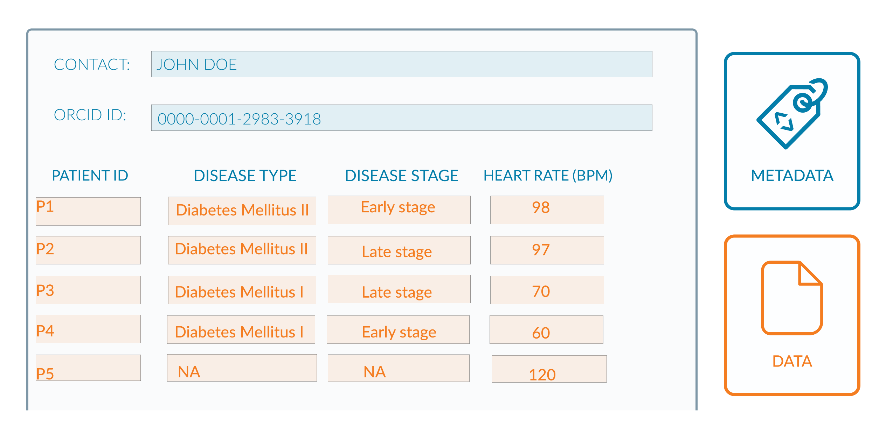
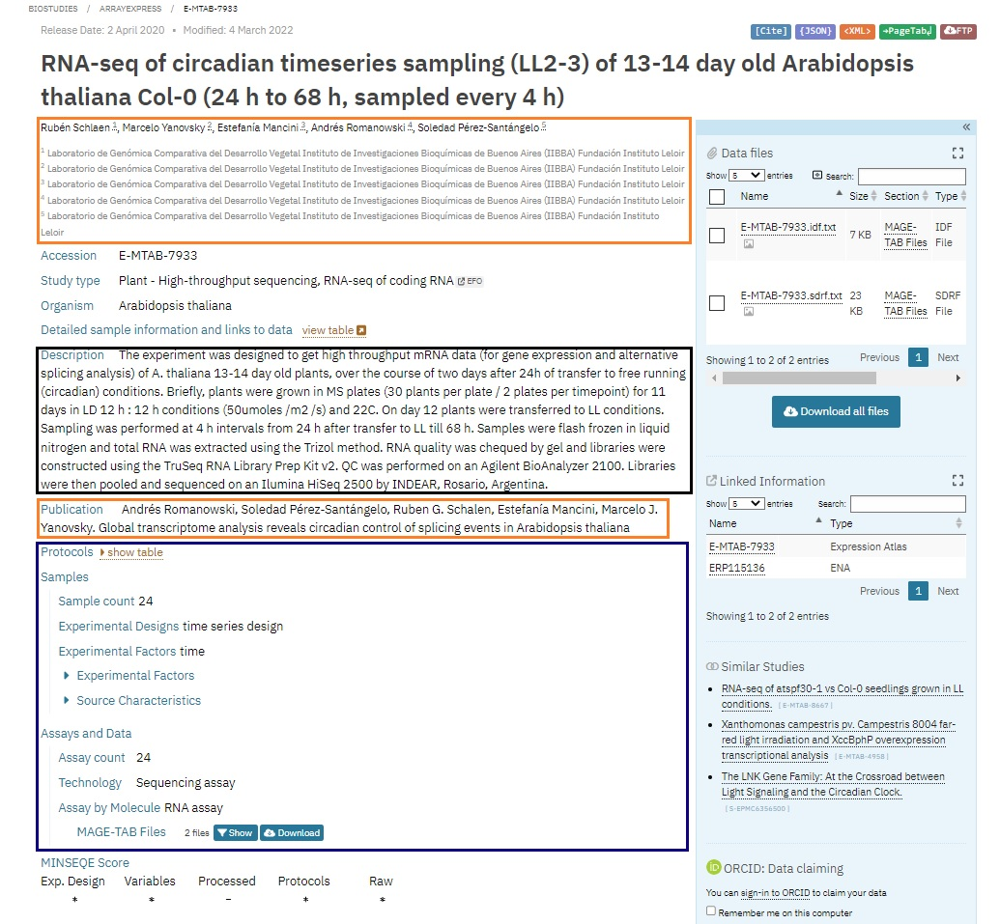
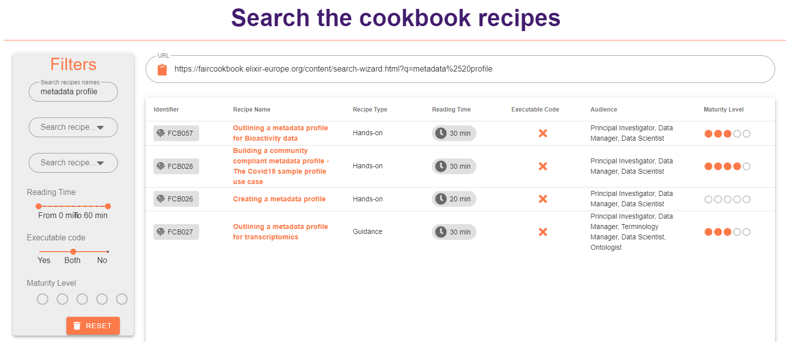
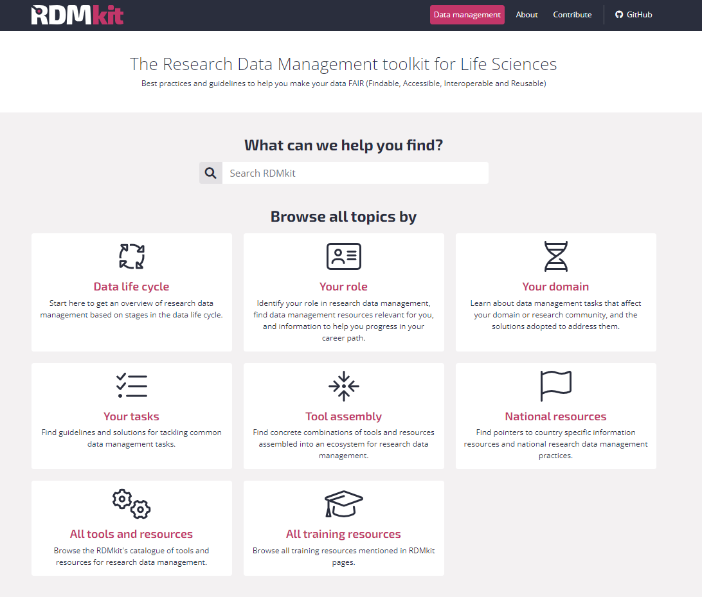
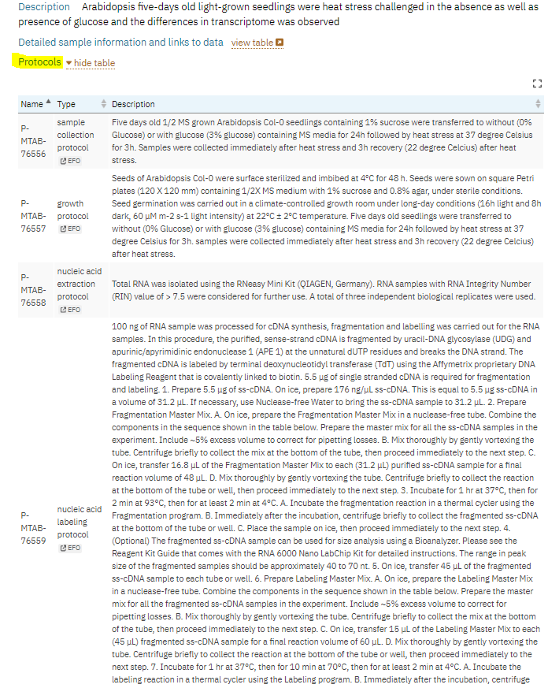
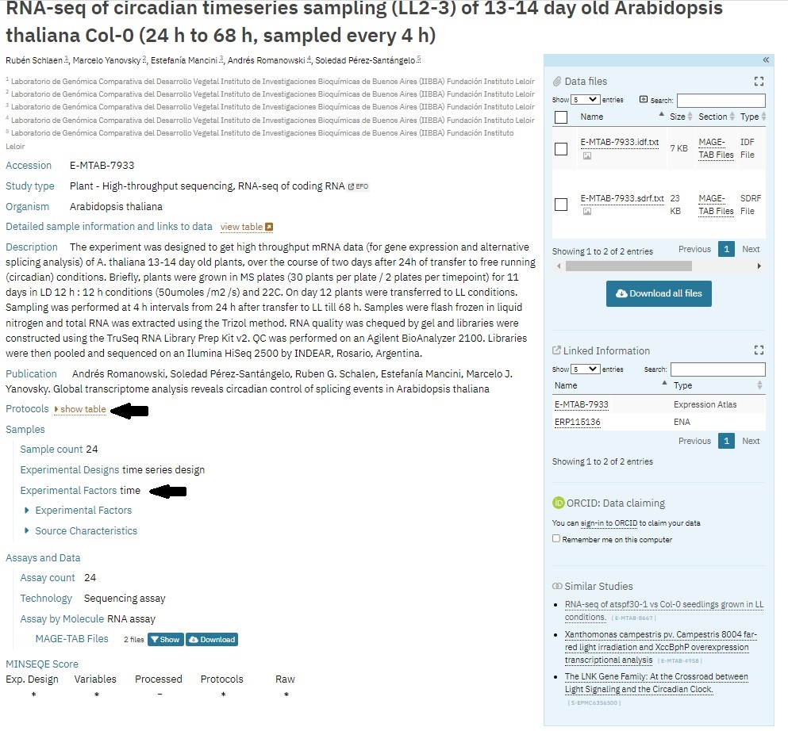
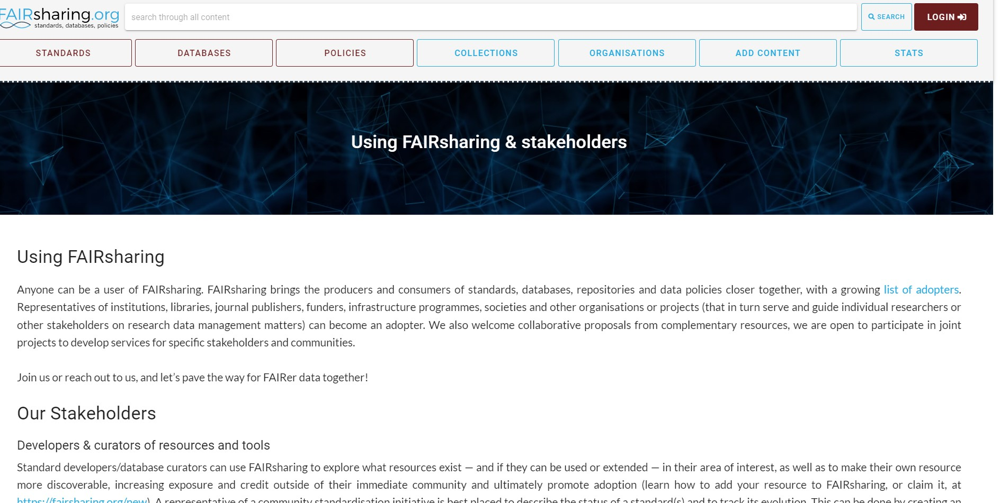
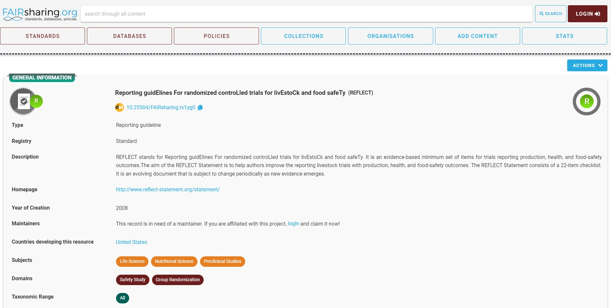
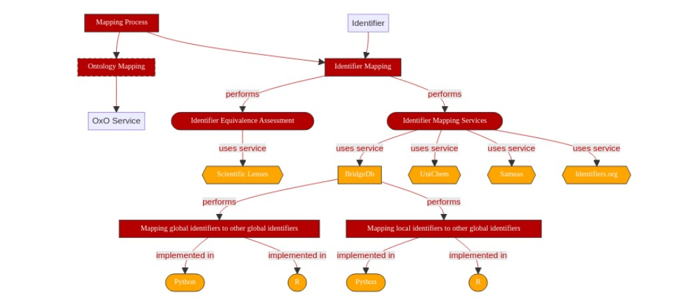

::: callout
## Outcomes
1- Define metadata and its various types.

2- Recall the community standards and how to apply
them to data and metadata.

3- Define data provenance.
:::

## Meta-data

The description of your data is called metadata. In other words, if we had a data file containing data values for an assay, such as an Excel spreadsheet, column headings are used to assign meaning and context. The data values are the data in this case, and the metadata are the column headings. Any documentation or explanation of the accompanying excel file is also considered metadata.

As seen in the image below, the data is coloured orange to represent the heart rate, genotype, and patient ID. The metadata that describes what this data is (the name of the cohort, the contact e-mail for more information on the dataset) is shown in blue.

{alt='alt text'}

## What else would metadata reveal?
To understand what else metadata can describe, let's have a look again on the previous image, **what else would you like to add to understand the data more?**

Additional metadata for provenance and general descriptions can be added. More information about the cohort name, for example, is required because "Human Welsh Cohort" does not tell us much in comparison to other existing Welsh cohorts. Here, we would include a unique ID or working title for the cohort, as well as a project URL describing its origin and composition.

The column headings appear to be complete, though there are some issues with the data in orange. The diabetes status column appears to capture the disease's type and stage.
- In row 3, it is unclear whether the disease is Diabetes Mellitus or Diabetes Insipidus.
- In row 4, it is unclear whether the type of diabetes mellitus is 1 or 2.
- There is an empty space in the final row. It is unclear whether this is due to a lack of information or the patient does not have diabetes.
So to do this better, two separate columns are created for the type and stage of the disease. The disease's name included whether it was type 1 or type 2. You can check this in this figure
{alt='alt text'}

**Building on the previous examples,**metadata can show a variety of things, such as your data's characteristics and data provenance, which explains how your data was created. Metadata is classified into three types: descriptive, structural, and administrative.

- **Descriptive Metadata** describes the characteristics of the dataset
- **Structural Metadata** describes how the dataset is generated and structured internally.
- **Administrative metadata** describes who was in charge of the data, who worked on the project, and how much money was spent.

::: discussion
## Identify types of metadata in this microarray dataset
Let's look at an example using microarray data from the arrayexpress database. This dataset contains data and metadata. The **administrative metadata** can be found in the orange square. The **descriptive metadata** is located in the black square, and as you can see, it summarize the dataset. The structure of dataset and files are marked by dark blue square which represents  **structural metadata**. 
{alt='alt text'}
:::

:::::::::::::::::::::::::::::: challenge
## Exercise
- From the FAIRcoobook, can you find the recipe on how to create metadata profiles for your dataset? you can start from [here](https://faircookbook.elixir-europe.org/content/home.html)

:::::: solution
First of all, let's understand the structure of the FAIRCookbook. For a quick overview, you can watch our RDMBites on FAIRcookbook [FAIRcookbook RDMBites](https://drive.google.com/drive/folders/16XZtCWBR-F3cvDHkB7A8jkjj6wvQ7sOr)

The building unit of FAIR cookbook is called a recipe, The recipe is the term used to describe instructions for how to FAIRify your data. As you see in the image, the structure of each recipe includes these main items:
1- Graphical overview which is the mindmap for the recipe
2- Ingredients which gives you an idea for the skills needed and tools you can use to apply the recipes
3- The steps and the process
4- Recommendations of what to read next and references to your reading
{alt='alt text'}

So let's use the search box and write down metadata profiles
{alt='alt text'}
As you see the results comes up, choose metdata profiles. As we explained earlier the recipe shows necessary steps for  creating metadata profiles for different data types
{alt='alt text'}
:::::::
:::::::::::::::::::::::::::::::::::::::

## Data and metadata should follow Community standards
Each data type has its own community that develops guidelines to ensure that metadata and data are appropriately described. Make sure to follow the community standards when describing your data. This becomes increasingly important as your data will become more reliable for other researchers. If you decide to use other guidelines, make sure you clearly document this. The use of community standards allows your data to be reused while also making it easily interoperable across multiple platforms.
We provide examples of various community standards that you can use to ensure that your data is described correctly.

:::::::::: challenge
## Exercise
RDMkit provides a nice domain specific-training on [community standards for each domain](https://rdmkit.elixir-europe.org/your_domain), using this training, can you find the bioimage community standards?

:::: solution
RDMkit is The Research Data Management toolkit for Life Sciences. It provides Best practices and guidelines to help you make your data FAIR (Findable, Accessible, Interoperable and Reusable). It also provides catalogue of tools and resources for research data management. 
{alt='alt text'}

As you can see in the above image, RDMkit covers a variety of research data management topics. The community standards are covered under domain tab. 
It provides community standards for all types of data. 
{alt='alt text'}

You can find the bioimage community standards on top of the page. As you can see, it covers the following
1- What is bioimage data and metadata?

2- Standards of bioimage research data management

3- bioimage data collection

4- Data publication and archiving
{alt='alt text'}
::::
:::::::::

## Data Provenance

**Provenance** is the detailed description of the history of the data and how it is generated.
Here is an example from arrayexpress database where there is accurate description of the data which allow the reusability of microarray data. 
As you can see in this example from **E-MTAB-6980** dataset, there is rich description of the study design, organism, platform and timing of data collection. 

{alt='alt text'}

---

::::::::::::: challenge
## Exercise
- Can you extract data provenance from this data set [E-MTAB-7933](https://www.ebi.ac.uk/biostudies/arrayexpress/studies/E-MTAB-7933)? 

::::: solution
As you can see in this picture, you wil find data provenance in under protocol and experimental factors tab.
{alt='alt text'}
:::::
:::::::::::::

## Vocabularies are FAIR
The metadata and data should be described by vocabularies that comply with FAIR which means that metadata and data should be:

**F** globally unique and persistent identifiers                           
**A** accessible documentation that extensively describes your identifiers

**I** Vocabularies are interoperable

**R** Can be reused and interpreted easily by humans and machines

::::::::::::: challenge
## Exercise
You are researcher working in the field of food safety and you are doing clinical trial, do you know how to choose the right vocabularies and ontologies for it?

:::: solution
It is time to introduce you to [FAIRsharing](https://fairsharing.org/), a resource for standards, databases and policies. The FAIRsharing is an important resource for researchers to help them identify the suitable repositories, standards and databases for their data. It also contains the latest policies from from governments, funders and publishers for FAIRer data.

{alt='alt text'}
You can use the search wizard, to look for the guidelines for reporting the data and metadata of randomized controlled trials of the livestock and food. 

{alt='alt text'}
In the results section, you can find REFLECT guidelines. 

{alt='alt text'}
For each resource/guideline, you will find general information, relationship graph, organization funding and maintaining the resource
::::
:::::::::::::::::

## Linked metadata
When uploading your dataset to any database, you should include the following information:

1- Additional datasets that supplement your data

2- It should be stated if your dataset is built on another dataset.

::::: challenge
## Exercise
How could you interlink data to your dataset?

::: solution
One of ways to do this, is to follow the FAIRcookbook recipes on interlinking data from different resources as presented in this graphical overview. you can find the recipe [here](https://faircookbook.elixir-europe.org/content/recipes/interoperability/identifier-mapping.html)

{alt='alt text'}
:::
:::::

## Metadata and data are always available
The maintenance of the data sets in the public database comes at a cost. This can be avoided by maintenance of the metadata instead. Metadata is small and can be easily maintained not only on the database but personal computer of researchers. This also the case for sensitive data where the metadata are available and provides contact details of the researchers, how to get the data and data provenance

Usually, when the data is generated, both metadata and data files are separate files. As a researcher, you should ensure that both files refer to each other.

::: callout
## Resources
You can learn more about how to describe your data using FAIR vocabularies and formal language for knowledge representation from the following:

- Recipe from the FAIRCookbook on[FAIR and the notion of metadata](https://faircookbook.elixir-europe.org/content/recipes/introduction/metadata-fair.html)

- RDMkit explanation of machine readability[Machine readability](https://rdmkit.elixir-europe.org/machine_actionability)

- Read more about vocabularies and ontologies from 
[Vocabularies and ontology](https://carpentries-incubator.github.io/fair-bio-practice/06-being-precise/index.html)

- [List of ontologies](https://obofoundry.org/)

- This is a nice introduction to metadata from Ed-DaSH carpentries course [Introduction to metadata](https://carpentries-incubator.github.io/fair-bio-practice/05-intro-to-metadata/index.html) 

- The following recipe from the FAIRCookbook provides instructions on how to create metadata profiles[Metadata profiles](https://faircookbook.elixir-europe.org/content/recipes/interoperability/creating-minimal-metadata-profiles.html): 

- RDMkit explanation on how to manage metadata: [Metadata management](https://rdmkit.elixir-europe.org/metadata_management.html)

- [Domain specific repositories](https://carpentries-incubator.github.io/fair-bio-practice/13-data-repositories/index.html): 

This is a lesson on types of repositories and give examples on domain specific repositories
- ED-DaSH lesson on how to choose a data repository [How do we choose a research data repository?](https://carpentries-incubator.github.io/fair-bio-practice/13-data-repositories/index.html)

- FAIRsharing provided a great information on writing domain specific metadata, you can find it [here](https://fairsharing.org/searchfairsharingRegistry=Standard&subjects=life%2520science&page=1)

- A recipe from the FAIRcookbook on how to [Interlink data from different sources](https://faircookbook.elixir-europe.org/content/recipes/interoperability/identifier-mapping.html#references)

- A nice guideline on [How can you record data provenance](https://rdmkit.elixir-europe.org/data_provenance)

- FAIRcookbook recipe on [Audit of the provenence process](https://faircookbook.elixir-europe.org/content/recipes/reusability/provenance.html)
:::

::: checklist
## FAIR principles
This episode covers the following principles:
(I2)  (meta)data use vocabularies that follow FAIR principles

(I1)  (meta)data use a formal, accessible, shared, and broadly applicable language for knowledge representation

(I3)  (meta)data include qualified references to other (meta)data

(A2) Metadata are accessible, even when the data are no longer available**
:::
