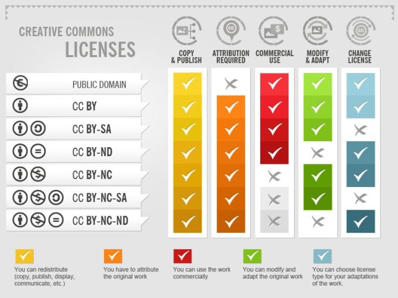

::: callout
## Objectives

1- To illustrate what is the communications protocol  

2- To articulate  what are the criteria for open and free protocol

3- To relate to the quote “As open as possible as close as necessary” by giving examples on sensitive data

3- To give examples of  databases that uses a protocol with   different  authentication process 

4- To interpret the usage licence associated with different data sets

:::

 Standard communication protocol 

(A1)   	(meta)data are retrievable by their identifier using a standardised communications protocol

**protocol** is a method that connects two computers, the protocol ensure security, authenticity of your data. Once the safety and authenticity of the data is verified, the transfer of data to another computer happens.

Having a protocol does not guarantee that your data are accessible. The protocol should be free and open and allow easy and exchange of information. 

When you upload your data into database, the database executes protocol that allows the user to  load data in the user’s web browser. This protocol allows the easy access of the data but still secures the data. 

::: discussion
## Authentication process
It is the process that a protocol uses for verification. To know what authentication is, suppose we have three people named John Smith. We do not know which one submitted the data. This is through assigning a unique ID for each one that is interpreted by machines and humans so you would know who is the actual person that submitted the data. Doing so is a form of authentication. This is used by many databases like Zenodo, where you can sign-up using ORCID-ID allowing the database to identify you.
:::

::: callout
## Resources
- Types of [SSH protocols](https://faircookbook.elixir-europe.org/content/recipes/accessibility/sftp.html)
- A nice explanation from RDMkit on protocols and how they will help you protect your data[Protocols and safety of data transfer](https://rdmkit.elixir-europe.org/data_transfer.html)
:::

::: challenge
## Exercise
After reading this guide on different [protocol types](https://rdmkit.elixir-europe.org/data_transfer.html#how-do-you-transfer-large-data-files), give an example on one of databases that uses one of these protocols?
:::

 Data usage licence 

**(R1.1)	meta(data) are released with a clear and accessible data usage licence**

This describes the legal rights on how others use your data. As you publish your data, you should describe clearly the licence of your data. Bear in mind that description of licence is important to allow machine and human reusability of your data. There are many licence that can be used e.g. MIT licence or Common creative licence. These licences provide accurate description of the rights of data reuse, Please have a look at resources in the description box to know more about these licences. 

{alt='alt text'}

::: callout
## Resources
Having your work licenced does not sound simple as it seems; here are some resources to help you find the correct licence for you:
- Why should you assign licence to your protocol from [here](https://rdmkit.elixir-europe.org/licensing)
- Step by step process for [licence](https://faircookbook.elixir-europe.org/content/recipes/reusability/ATI-licensing.html)
- Step by step process for [software licence](https://faircookbook.elixir-europe.org/content/recipes/reusability/ATI_licensing_software.html)
- Step by step process for [Data licence](https://faircookbook.elixir-europe.org/content/recipes/reusability/ATI_licensing_data.html)
- Step by step process for [Declaring data permitted uses](https://faircookbook.elixir-europe.org/content/recipes/reusability/expressing-data-use.html)
- [Creative commons licence](https://creativecommons.org/choose/)
:::

::: challenge
## Exercise
- From the previous resources that we provided, what is the licence used by the following datasets:
1- [Zenodo](https://zenodo.org/record/7368547#.Y4TjT3bP02w)

2- [Arrayexpress](https://www.ebi.ac.uk/biostudies/arrayexpress/studies/E-MTAB-7933)
::: 

 Sensitive data 

Sensitive data are data that, if made publicly available, could cause consequences for individuals, groups, nations, or ecosystems and need to be secured from unauthorised access. To determine whether your data is sensitive, you should consult national laws, which vary by country.

Through the following resources, you will know more about sensitive data and what to do if your data is  sensitive

::: callout
## Resources
To get more information on sensitive data, you can have a look on these reources:
- [What is sensitive data?](https://rdmkit.elixir-europe.org/sensitive_data)
- [How to describe the permitted use of data](https://faircookbook.elixir-europe.org/content/recipes/reusability/expressing-data-use.html#)
- [ELSI and GDPR](https://scilifelab-data-guidelines.readthedocs.io/en/latest/docs/general/sensitive_data.html)
:::

